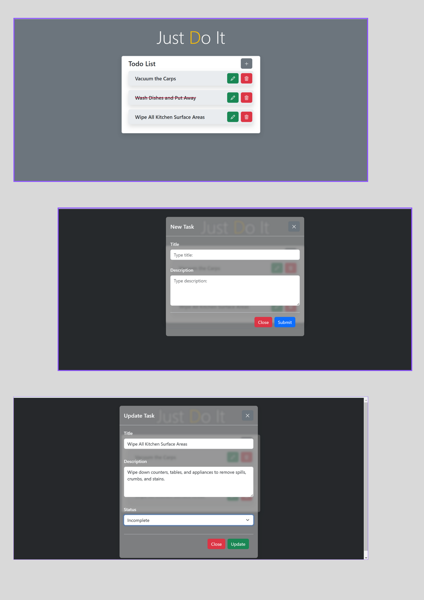

# A Simple To-Do List

## Overview 📌
A To-Do Task List with CRUD functionality is a task management tool that enables users to create, view, update, and delete tasks, helping them stay organized, prioritize responsibilities, and improve productivity.

## Features 📌
- **ADD Task**: Easily add new tasks to the list.
- **UPDATE Task**: Modify task details as needed.
- **DELETE Task**: Remove tasks when they are no longer needed.

## Tech Stack 📌
- **Frontend**: HTML, CSS, Bootstrap
- **Backend**: Laravel
- **Database**: MySQL
